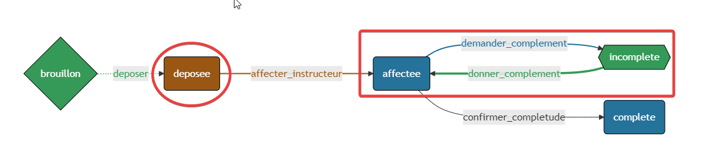

== Fixtures

[%step]
[source,php,highlight="1..5|1..3"]
----
$toto = new Toto();

$toto->setToto('truc');

assertEquals($toto->getToto(), 'truc');
----

[NOTE.speaker]
====

Littérature Objet pour les tests

Dans les tests c'est ca une fixture.

Dans Symfony c'est Doctrine Fixtures dont on m'a parlé

Doctrine === ORM
====

=== FixtureBundle

[source,php,highlight="1..3|7..8|1..10"]
----
class AppFixtures extends Fixture
{
    public function load(ObjectManager $manager): void
    {
        $objet = new Object();

        $this->addReference("reference", $objet);
        $this->getReference("reference", $objet::class);
    }
}
----
[NOTE.speaker]
====

* MANAGER = *bdd*

* Exécution load des classes fixtures

* Registre de référence => partage

====

=== Gestion dépendances

[source,php,highlight="1|3..6|1..7]
----
class AppFixtures extends Fixture implements DependentFixtureInterface
{
    public function getDependencies(): array
    {
        return [];
    }
}
----
[NOTE.speaker]
====

* Interface
* getDependencies == ordonnancement

====

=== Première fixture

[source, php,%linenums,highlight="1..4|5..9|11 ..12|14|1..14"]
----
class AppFixturesBasis extends Fixture
{
    public function load(ObjectManager $manager): void
    {
        $demandeur = new Demandeur();
        $demandeur->setEmail('test@test.test');
        $demandeur->setFirstname('John');
        $demandeur->setLastname('Doe');
        $demandeur->setRoles([Role::ROLE_DEMANDEUR->name]);

        $manager->persist($demandeur);
        $manager->flush();

        $this->addReference('DEMANDEUR', $demandeur);
    }
}
----

[NOTE.speaker]
====

Données -> persistance ->reference

Demandeur != candidat
demandeur == pas dans keycloak

=> Notion de candidat.

====

=== Créons donc un Candidat.

[source, php,%linenums,highlight="3|5..10|11"]
----
public function load(ObjectManager $manager): void
{
    $candidate = new Candidate();

    $candidate->setFirstName("John");
        ->setLastName("Doe")
        ->setEmail("john.doe@test.test")
        ->setSiren("123456789")
        ->setName("Société")
        ->setPassword("motDePasse");
    $this->candidateService->create($candidate);
}
----

[NOTE.speaker]
====
Maintenant, on a un candidat, mais surtout un candidat avec lequel on pourra se connecter dans l'application.

Candidate Service :

* Création d'un utilisateur dans Keycloak
* Sauvegarde en bdd
* Envoi du mail d'activation du compte
* Création d'un historique de création
* Société
====

=== La notion de périmètre

[%step]
[source, php,%linenums,highlight="1..9|1,9..18"]
----
class GeographicDataFixtures extends Fixture
{
    public function load(ObjectManager $manager): void
    {
        $this->departementRegionCommand->execute($this->input, $this->output);
        $this->epcisCommand->execute($this->input, $this->output);
        $this->communesCommand->execute($this->input, $this->output);
    }
}

class AppFixtures extends Fixture
{
    public function getDependencies(): array
    {
        return [
            GeographicDataFixtures::class,
        ];
    }
----

[NOTE.speaker]
====
On a parlé de demande, et de périmètre d'une demande.
Elles sont où les données géographiques ?

Heureusement, nous avons une commande qui permet de créer des communes, des départements et des régions.

On a donc un candidat, mais il nous faut également des instructeurs.
====

=== Les intervenants

[source,php,highlight="1..8|12|13..19|20|21|1..21"]
----
class IntervenantFixtures extends Fixture implements DependentFixtureInterface
{
    public function getDependencies(): array
    {
        return [
            GeographicDataFixtures::class,
        ];
    }

    public function load(ObjectManager $manager): void
    {
        foreach ($this->departementRepository->findAll() as $departement) {
            $instructeur = new Intervenant();
            $email = "instructeur_{$dpt->getCode()}@test.test";
            $instructeur->setFirstName('Instructeur')
                ->setLastName($departement->getNom())
                ->setEmail($email)
                ->setRoles([Role::ROLE_INSTRUCTEUR->name])
                ->setPerimetreSupervision((new PerimetreIntervention())->addDepartement($dpt));
            $this->intervenantService->create($instructeur);
            $this->addReference('INSTRUCTEUR_' . $dpt->getCode(), $instructeur);
        }
    }
}
----

[NOTE.speaker]
====

Comme pour les demandeurs, nous avons des services pour créer les instructeurs.
et nous allons créer des superviseur.

* Dépendant géo
* On parcourt tous les départements, on crée un instructeur par département.
* serviceCreateInstructeur ==  (Keycloak / histo)
* Stockage de la référence
* On prendra ensuite un principe similaire en parcours les régions pour créer des superviseurs.
====

=== Passons donc aux demandes

[source,php,%linenums,highlight="1|6,7|1..9"]
----
class DemandeFixtures extends Fixture implements DependentFixtureInterface
{
    public function getDependencies(): array
    {
        return [
            GeographicDataFixtures::class,
            IntervenantFixtures::class,
        ];
    }

----

[NOTE.speaker]
====
Pour les demandes, nous avons besoin d'instructeurs rendons les dépendants.
====

[%notitle]
=== Passons donc aux demandes

[source, php,%linenums,highlight="1..4|6..22|24|1..24"]
----
$candidate = $this->creeDemandeur(
    "John", "Doe", "john.doe@test", "123456789", "Société", "motDePasse"
);
$commune = $this->communeRepository->findOneBy(['nom' => 'Bordeaux']);

$param = [
    'demandeur' => [
        'tel' => '+33600000000',
        'company' => [
            'creationDate' => '2024-01-01',
            'formeJuridique' => 'autres',
            'perimetreIntervention' => ['departement' => $commune->getDepartement()->getNom()],
        ],
    ],
    'adresse' => [
        'adresse1' => 'numéro, nom de la voie',
        'adresse2' => 'complément adresse',
        'codePostal' => $commune->getCodePostaux()[0],
        'codeDepartement' => $commune->getDepartement()->getCode(),
        'ville' => $commune->getNom(),
    ],
];

return $this->demandeService->creeDemande($demandeur, $param);
----

[NOTE.speaker]
====

Une demande, c'est beaucoup d'informations, mais dans notre cas ce qui nous intéresse c'est le périmètre de la demande.

Là encore, on pourrait créer tous les objets, mais on a un service qui nous permet cela.

Nous utilisons le service pour créer notre demande.
====

[.columns]
=== La problématique des fichiers

[.column]
--

--

[.column]
--

--

[NOTE.speaker]
====

* Demande === *BEAUCOUP* de fichiers.
* Fichier === stockage sur disque et pas *que* en bdd
* Download ?

Le contenu du fichier, on s'en moque un peu, il faut qu'il y en ait un pour que l'on puisse les manipuler dans l'application.

====

[%notitle]
=== La problématique des fichiers

[source,php,%linenums,highlight="1..9|16..22|15|10..14|1..24"]
----
public function createUploadedFile(string $nom): UploadedFile
{
    $this->filesystem->copy(
        originFile:'/var/www/html/src/DataFixtures/test_files/test.pdf',
        targetFile: "/tmp/$nom",
        overwriteNewerFiles: true);

    return new UploadedFile("/tmp/$nom", $nom, 'application/pdf', test: true);
}
public function addPjsBrouillon(
    DemandeAgrement $demande,
    string $nom,
    string $codeTypePj,
): PieceJointe {
    return $this->pieceJointeService->createPieceJointe(
        new PieceJointeModel(
            nom: $nom,
            fichier: $this->fixtHelpers->createUploadedFile($nom),
            demande: $demande,
            user: $demande->getDemandeur(),
            codeTypePj: $codeTypePj
        )
    );
}

----

[NOTE.speaker]
====

Un fichier téléversé, c'est un UploadedFile
* dans /tmp avec un nom

* modele PJ
* appelle service (histo, stockage sur disque, téléchargement ...)
* Encapsulage dans une fonction

On a donc une fonction qui permet de créer un fichier qui pourra être manipulé par notre application.

====

=== Demandes & fichiers

[source,php,highlight="1,3|4..8|1..8"]
----
$demande = $this->getReference('DEMANDE', Demande::class);

foreach (Demande::Procedure as $typePj) {
    $this->fixtureService->addPjsBrouillon(
        demande: $demande,
        nom: "test_{$typePj->nom}.pdf",
        codeTypePj: $typePj->code()
    );
}
----

[NOTE.speaker]
====

Demande == beaucoup de fichiers.

L'utilisateur télécharge les fichiers un à un par demande dans le parcours de création.
Nous connaissons les types de fichiers nécesaires pour une demande.
Notre demande est donc complète.
====

=== Ce n'est que le début de l'histoire

[NOTE.speaker]
====
Ce n'est pas lisible
====

=== Ce n'est que le début de l'histoire

[NOTE.speaker]
====
Toujours pas
====

[%notitle]
=== Ce n'est que le début de l'histoire

[NOTE.speaker]
====

C'est mieux ?

* Vert => demandeur
* Orange/Marron => Superviseur
* Bleu => Instructeur

Brouillon => Déposée => Affectée <=> Incomplete => Complete

====

=== Dépôt d'une demande

[source,php]
----
$demande = $this->getReference('DEMANDE', Demande::class);
$demandeur = $this->getReference('DEMANDEUR', Demandeur::class);

$this->demandeService->deposer(user: $demandeur, demande: $demande);
----

[NOTE.speaker]
====
Action simple, besoin d'une demande d'un demandeur.
Par contre l'action de déposer une demande va déclencher une série d'événements.
====

=== Dépôt d'une demande

[NOTE.speaker]
====

* validation payload
* transition
* bdd
* histo
* mail instructeur & demandeur

====

=== Demande de complément et réponse

=== On continue le parcours

[source,php,%linenums,highlight="1..4|6|8|10..12|14|1..14"]
----
$demande = $this->getReference('DEMANDE', Demande::class);
$demandeur = $this->getReference('DEMANDEUR', Demandeur::class);
$instructeur = $this->getReference('INSTRUCTEUR_33', Intervenant::class);
$superviseur = $this->getReference('SUPERVISEUR_75', Intervenant::class);

$this->demandeService->affecterDemande(user: $superviseur, demande: $demande, instructeur: $instructeur);

$this->demandeService->demanderComplément(user: $instructeur, demande: $demande, commentaire: 'Commentaire');

$this->demandeService->addPjsBrouillon($demande, "complement1.pdf", "complement");
$this->demandeService->addPjsBrouillon($demande, "complement2.pdf", "complement");
$this->demandeService->donnerComplement(user: $demandeur, demande: $demande);

$this->demandeService->confirmerCompletude(user: $instructeur, demande: $demande);
----
[NOTE.speaker]
=====

* Récup demandeur & intervenant
* Affectation Superviseur, instructeur et demande
* Demande de complément instructeur & commentaire
* donner complément fichier + action simple
* confirmer complétude simple instructeur

=====

=== La demande est complète.

[NOTE.speaker]
====

* Données OK
* Connexion OK
*% fichiers OK
* Consulation OK
* Historisque bof

====

=== Pas trop vite

[NOTE.speaker]
====
Le demandeur à déposé 25 fichiers, l'instructeur les a contrôlé et a demandé des compléments, le demandeur a répondu et l'instructeur a confirmé la complétude.
Le tout a 1,3 seconde.
Pas très réaliste.

====