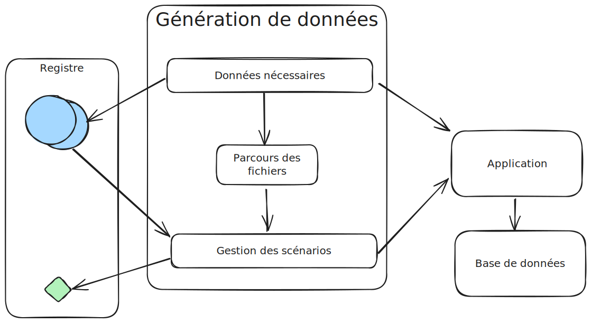

= Fixtures et si on allait au-delà des données
:icons: font
:revealjs_theme: simple
:revealjs_slideNumber: true
:revealjs_history: true
:revealjs_pdfseparatefragments: false
:source-highlighter: highlight.js
:revealjs_width: 1280
:customcss: css/custom.css
:toc:

[NOTE.speaker]
====
Bonjour merci aux organisateurs de me permettre de participer au sud ouest Days.

Aujourd'hui, je vais vous parler de fixtures mais pas que, et si on allait au-delà des données ?

====

== Quand vous arrivez sur un projet...

[NOTE.speaker]
====
Je ne sais pas pour vous, mais en général, pour moi, quand je commence à travailler sur un projet existant.

Cela commence par cela.
====

[.columns]
[%notitle]  
=== L'installation ...

[.column]
--
image::images/intro/readme.png[readme,100px]
--
[.column]
--
image::images/intro/git.png[git,100px]
--

[.column]
--
image::images/intro/npm.png[npm,100px]
--

[.column]
--
image::images/intro/logo-composer-transparent.png[composer,100px]
--

[.column]
--
image::images/intro/docker-compose.png[docker,100px]
--

[.column]
--
image::images/intro/doctrine-logo.svg[doctrine,100px]
--

[NOTE.speaker]
====
* Je lis le readme, oui oui, c'est intéressant à lire, bon ok pas tout, mais au moins les étapes d'installation.
* Je récupère les sources,
* J'installe les dépendances,
* Je lance les containers ou configure nos briques techniques.
* J'initialise le schéma de base de données et je lance mes migrations
* Et je suis prêt à travailler, enfin presque.

====

[.columns]
=== Et les données ?

[.column]
--
[step=1]
image::images/intro/task.png[task,300px]
--

[.column]
--
[step=2]
image::images/intro/old_hdd.png[task,300px]
--

[.column]
--
[step=4]
image::images/intro/404.png[404,600px]
--

[.column]
--
[step=3]

--

[NOTE.speaker]
====

* Finalement, c'est "intéressant" de lire tout le readme, il y a la procédure d'initialisation des données en 300 étapes (ou presque).
* Ou alors, on a un dump de la base de données de production (anonymisé bien sûr)

Dans mon cas, il n'y avait pas de procédure d'anonymisation ni procédure capilotractée pour l'initialisation des données.

Du coup et comme je n'avais pas envie de tout faire à la main, j'ai commencé à essayer de trouver une solution.
Apparemment, tout le monde me dit qu'il faut mettre en place des fixtures.

La suite de cette conférence est un retour d'expérience sur la mise en place de fixtures au sein de mon projet.
====

[.columns]
== Qui suis-je ?

[.column]
--
image::images/avatar.png[nico,80%]
--

[.column.has-text-left]
--
**Nicolas**

Développeur PHP, Symfony

TechLead PHP, Architecte
--

[.column]
--
image::images/gop-mini.png[gop,80px,float="left"]
onepoint BDX
--

== Contexte

[NOTE.speaker]
====
Le projet sur lequel nous travaillons est une application web composée de 3 briques.
Un backend PHP, un front en angular et une brique d'authentification avec KeyCloak.

Cette application gère des demandes d'agrément.
Une demande a un cycle de vie complexe, nous avons besoin de mettre en place des jeux de données pour chaque état.

Présenter le workflow MAR et présenter notre workflow

Demande => ajout de fichier => deposer la demande => donner son avis par périmètre => finaliser agrément

Une demande comprend
* l'identité de notre demandeur,
* des informations sur ses qualifications.
* des informations sur sa société.
* plusieurs fichiers relatifs à sa demande
* un périmètre d'intervention sur lequel son agrément va être valide.

Une fois un dossier constitué un demandeur va déposer son dossier.
Ces demandes sont instruites par des instructeurs et des superviseurs.
Une demande déposée va être ensuite affectée à un instructeur par un superviseur.
L'instructeur instruit le dossier et donne son avis passant ensuite la main à un superviseur.
Le superviseur va confirmer ou non l'avis de l'instructeur et valider ou refuser la démande d'agrément.

Chaque étape doit être historisée afin de permettre un audit de ce process étape par étape et tracer qui à fait quelle action.

J'ai donc besoin de créer des données pour chacune de ces opérations.

Comme précisé précédemment, on m'a conseillé de mettre en place des fixtures.
Le projet étant en symfony, je me suis ainsi tourné vers le DoctrineFixtureBundle de Symfony.
====

=== FixtureBundle

[source,php,%linenums,highlight="1|3..6|8|12..13"]
----
class AppFixtures extends Fixture
{
    public function getDependencies(): array
    {
        return [];
    }

    public function load(ObjectManager $manager): void
    {
        $objet = new Object();

        $this->addReference("reference", $objet);
        $this->getReference("reference", $objet::class);
    }
}
----

[NOTE.speaker]
====
Permet la création de classe dépendant de fixutre
Toutes ces classes  du dossier fixutre sont exécutées.
Get dépendencies permet l'intégration de dépendance entre le fixutres
Le manager permet d'accéder à l'entity manager et donc accéder à la base de données.
Dernier mécanisme le register de référence, permettant d'accéder à des objets déjà créés.
====

=== Première étape

[source, php,%linenums,highlight="1..4|5..8|10..12|13"]
----
class AppFixturesBasis extends Fixture
{
    public function load(ObjectManager $manager): void
    {
        $demandeur = new Demandeur();
        $demandeur->setEmail('test@test.test');
        $demandeur->setFirstname('John');
        $demandeur->setLastname('Doe');
        $demandeur->setRoles([Role::ROLE_DEMANDEUR->name]);

        $manager->persist($demandeur);
        $manager->flush();

        $this->addReference('DEMANDEUR', $demandeur);
    }
}
----

[NOTE.speaker]
====

Ok, nous avons un objet Demandeur, mais un demandeur c'est avant tout un utilisateur de l'application.
Il doit donc être présent dans ma briqure d'authentification.
Il faut donc également créer un utilisateur dans dans Keycloak.
N'a-t-on pas un service qui permet de créer un utilisateur dans l'application ?
====

=== Créons donc un Candidat.

[source, php,%linenums,highlight="3|5..10|11"]
----
public function load(ObjectManager $manager): void
{
    $candidate = new Candidate();

    $candidate->setFirstName("John");
        ->setLastName("Doe")
        ->setEmail("john.doe@test.test")
        ->setSiren("123456789")
        ->setName("Société")
        ->setPassword("motDePasse");
    $this->candidateService->create($candidate);
}
----

[NOTE.speaker]
====
Maintenant, on a un candidat, mais surtout un candidat avec lequel on pourra se connecter dans l'application.

Candidate Service :

* Création d'un utilisateur dans Keycloak
* Sauvegarde en bdd
* Envoi du mail d'activation du compte
* Création d'un historique de création
====

=== Avons-nous tout ce qu'il nous faut ?

[%step]
[source, php,%linenums,highlight="5..7|1..3,9..18"]
----
class GeographicDataFixtures extends Fixture
{
    public function load(ObjectManager $manager): void
    {
        $this->departementRegionCommand->execute($this->input, $this->output);
        $this->epcisCommand->execute($this->input, $this->output);
        $this->communesCommand->execute($this->input, $this->output);
    }
}

class AppFixtures extends Fixture
{
    public function getDependencies(): array
    {
        return [
            GeographicDataFixtures::class,
        ];
    }
----

[NOTE.speaker]
====
On a donc un candidat, mais il nous faut également des instructeurs.
Comme pour les demandeurs, nous avons des services pour créer les instructeurs.
et nous allons créer des superviseur.
Sauf que nous avons besoin de données géographiques pour les instructeurs et les superviseurs.
Heureusement, nous avons un service qui permet de créer des communes, des départements et des régions.
====

=== Les intervenants

[source,php,%linenums,highlight="1..8|12|13..19|20|1..20"]
----
class IntervenantFixtures extends Fixture implements DependentFixtureInterface
{
    public function getDependencies(): array
    {
        return [
            GeographicDataFixtures::class,
        ];
    }

    public function load(ObjectManager $manager): void
    {
        foreach ($this->departementRepository->findAll() as $departement) {
            $instructeur = new Intervenant();
            $email = "instructeur_{$dpt->getCode()}@test.test";
            $instructeur->setFirstName('Instructeur')
                ->setLastName($departement->getNom())
                ->setEmail($email)
                ->setRoles([Role::ROLE_INSTRUCTEUR->name])
                ->setPerimetreSupervision((new PerimetreIntervention())->addDepartement($dpt));
            $this->intervenantService->create($instructeur);
        }
    }
}
----

[NOTE.speaker]
====
* Dépendant géo
* On parcourt tous les départements, on crée un instructeur par département.
* On appelle le service pour créer l'instructeur.
* On prendra ensuite un principe similaire en parcours les régions pour créer des superviseurs.
====

=== Passons donc aux demandes

[source, php,%linenums,highlight="1..3|5..21|23|1..23"]
----
$candidate = $this->creeDemandeur("John", "Doe", "john.doe@test", "123456789", "Société", "motDePasse");
$candidate->getUser()->setRoles([Role::ROLE_DEMANDEUR->name]);
$commune = $this->communeRepository->findOneBy(['nom' => 'Bordeaux']);

$param = [
    'demandeur' => [
        'tel' => '+33600000000',
        'company' => [
            'creationDate' => '2024-01-01',
            'formeJuridique' => 'autres',
            'perimetreIntervention' => ['departement' => $commune->getDepartement()->getNom()],
        ],
    ],
    'adresse' => [
        'adresse1' => 'numéro, nom de la voie',
        'adresse2' => 'complément adresse',
        'codePostal' => $commune->getCodePostaux()[0],
        'codeDepartement' => $commune->getDepartement()->getCode(),
        'ville' => $commune->getNom(),
    ],
];

return $this->demandeService->creeDemande($demandeur, $param);
----

[NOTE.speaker]
====
Une demande, c'est beaucoup d'informations, mais dans notre cas ce qui nous intéresse c'est le périmètre de la demande.
On peut également factoriser notre code pour le demandeur.
Là encore, on pourrait créer tous les objets, mais on a un service qui nous permet cela.
Encore une fois, on va utiliser le service pour créer notre demande.
====

[.columns]
=== La problématique des fichiers

[.column]
--

image::images/fichier_bash.png[fichier]
--

[.column]
--
image::images/fichier_test.png[fichier,300px]
--

[NOTE.speaker]
====
* Demande === *BEAUCOUP* de fichiers.
* Fichier === stockage sur disque et pas *que* en bdd

La complexité est qu'une demande est composée de plusieurs fichiers.
Et qu'il faut les télécharger sur l'application.
Le contenu du fichier, on s'en moque un peu, mais il faut qu'il y en ait un pour que par la suite on puisse les manipuler dans l'application.
====

=== La problématique des fichiers

[source,php,%linenums,highlight="1..9|10..14|17..22|16|1..23"]
----
public function createUploadedFile(string $nom): UploadedFile
{
    $this->filesystem->copy(
        originFile:'/var/www/html/src/DataFixtures/test_files/test.pdf',
        targetFile: "/tmp/$nom",
        overwriteNewerFiles: true);

    return new UploadedFile("/tmp/$nom", $nom, 'application/pdf', test: true);
}

public function addPjsBrouillon(
        DemandeAgrement $demande,
        string $nom,
        string $codeTypePj,
    ): PieceJointe {
        return $this->pieceJointeService->createPieceJointe(
            new PieceJointeModel(
                $nom,
                $this->fixtHelpers->createUploadedFile($nom),
                $demande,
                $demande->getDemandeur(),
            )
        );
    }

----

[NOTE.speaker]
====
On a donc une fonction qui permet de créer un fichier qui pourra être manipulé par notre application.
Pour aller plus loin, on va également utiliser le service de l'application pour finaliser la création d'un fichier.
====

=== Demandes & fichiers

[source,php,%linenums,highlight=1..2|4..6]
----
$demande = $this->getReferece('DEMANDE', Demande::class);

foreach (Demande::Procedure as $typePj) {
    $this->fixtureService->addPjsBrouillon($demande, "test_{$type}.pdf", $typePj->code());
}
----

[NOTE.speaker]
====
L'utilisateur télécharge les fichiers un à un par demande dans le parcours de création.
Nous connaissons les types de fichiers nécessaire pour une demande.
Notre demande est donc complète.
====

=== Ce n'est que le début de l'histoire

image::images/workflow_mar_complet.svg[workflow,30%]

=== Ce n'est que le début de l'histoire

image::images/workflow_mar_simplifie.svg[workflow,100%]

=== Ce n'est que le début de l'histoire

image::images/workflow_mar_start.svg[workflow,100%]

[NOTE.speaker]
====

* Vert => demandeur
* Orange/Marron => Superviseur
* Bleu => Instructeur

Brouillon => Déposée => Affectée <=> Incomplete => Complete
====

=== Dépôt d'une demande

[source,php]
----
$demande = $this->getReferece('DEMANDE', Demande::class);
$demandeur = $this->getReferece('DEMANDEUR', Demandeur::class);

$this->demandeService->deposer(user: $demandeur, demande: $demande);
----

[NOTE.speaker]
====
Action simple, besoin d'une demande d'un demandeur.
Par contre l'action de déposer une demande va déclencher une série d'événements.
====

=== Dépôt d'une demande

=== Demande de complément et réponse

image::images/workflow_mar_start.svg[workflow,100%]

=== Et on continue le parcours

[source,php,%linenums,highlight="1..4|6|8|10..13|15|1..15"]
----
$demande = $this->getReferece('DEMANDE', Demande::class);
$demandeur = $this->getReferece('DEMANDEUR', Demandeur::class);
$instructeur = $this->getReferece('INSTRUCTEUR', Intervenant::class);
$superviseur = $this->getReferece('SUPERVISEUR', Intervenant::class);

$this->demandeService->affecterDemande(user: $superviseur, demande: $demande, instructeur: $instructeur);

$this->demandeService->demanderComplément(user: $instructeur, demande: $demande, commentaire: 'Commentaire');

$this->demandeService->addPjsBrouillon($demande, "complement1.pdf", "complement");
$this->demandeService->addPjsBrouillon($demande, "complement2.pdf", "complement");

$this->demandeService->donnerComplement(user: $demandeur, demande: $demande);

$this->demandeService->confirmerCompletude(user: $instructeur, demande: $demande);
----

=== Et on continue le parcours

image::images/workflow_mar_start.svg[workflow,100%]

[NOTE.speaker]
====
C'est parfait je teste j'arrive à me connecter avec un utilisateur et je confirme que la demande est bien à l'état complet.
Bon par contre l'historique n'est pas du tout réaliste.

Le demandeur à déposé 25 fichiers, l'instructeur les a contrôlé et a demandé des compléments, le demandeur a répondu et l'instructeur a confirmé la complétude.
Le tout a 1,3 seconde.
Pas très réaliste.
====

=== Il est temps de voyager

image::images/delorean3.png[delorean]

=== SymfonyClock

[source, php]
----
use function Symfony\Component\Clock\now;

// Get the current time as a DatePoint instance
$now = now();

Clock::set(new MockClock("2024-01-01"));
----

[NOTE.speaker]
====
SymfonyClock est une librairie qui permet de gérer le temps dans nos tests.
On peut donc fixer le temps à une date précise. (MockClock) ou utiliser le temps réel (NativeClock).

Avec MockClock on a tout ce qu'il nous faut pour rendre notre cas de test réaliste.
====

=== C'est parti Marty

[source,php,%linenums,highlight="1..2|1,4,7,10,13|1..14"]
----
Clock::set(new MockClock("2024-06-01"));
$this->demandeService->affecterDemande(user: $superviseur, demande: $demande, instructeur: $instructeur);

Clock::set(new MockClock("2024-06-08"));
$this->demandeService->demanderComplément(user: $instructeur, demande: $demande, commentaire: 'Commentaire');

Clock::set(new MockClock("2024-06-16"));
$this->demandeService->addPjsBrouillon($demande, "complement1.pdf", "complement");

Clock::set(new MockClock("2024-07-01"));
$this->demandeService->addPjsBrouillon($demande, "complement2.pdf", "complement");

Clock::set(new MockClock("2024-07-22"));
$this->demandeService->donnerComplement(user: $demandeur, demande: $demande);
----

[NOTE.speaker]
====
On peut maintenant fixer le temps pour chaque action.
En plus de rendre notre test réaliste, cela va nous permettre également d'activer certaines actions.
Par exemple, il est possible de rejeter une demande si un utilisateur n'a pas répondu dans les 30 jours.
====

=== C'est parti Marty

[source,php,%linenums,highlight="1..5|7..8|10,11|1..11"]
----
Clock::set(new MockClock("2024-06-01"));
$this->demandeService->affecterDemande(user: $superviseur, demande: $demande, instructeur: $instructeur);

Clock::set(new MockClock("2024-06-08"));
$this->demandeService->demanderComplément(user: $instructeur, demande: $demande, commentaire: 'Commentaire');

Clock::set(new MockClock("2024-07-09"));
$this->demandeCommand->checkDelaiReponse();

Clock::set(new MockClock("2024-07-09"));
$this->demandeService->refuserDemande(user: $instructeur, demande: $demande, commentaire: 'Hors délai');
----

[.columns.is-vcentered]
== En résumé
[%step]
[.column]
--
Données géographiques

Intervenant
--

[%step]
[.column]
--
Demandeur

Fichiers

Demandes
--

[%step]
[.column]
--
Le temps
--

[NOTE.speaker]
====
Nous avons pu alimenter les données de base (géographique notamment).
Créer nos intervenants (instruteur, superviseur et admin).

On a un cas de test réaliste avec des utilisateurs qui peuvent se connecter (Demandeur, instructeur, superviseur).
Nous avons des fichiers que les utilsiateurs peuvent consulter et donc vérifier leur présence.
On a pu créer nos données de manière cohérente.
Créer nos demandes

Gérer la temporalité des actions.

Par contre on a fait que coder

====

== Next

=== Nous avons besoin de quoi

[%step]
* Raconter une histoire (YAML)
* Des objets immuables (YAML)
* De parcourir des fichiers (PHP)
* De vérifier un peu (PHP)
* D'orchestrer tout ça (PHP)

=== Pourquoi faire des fixtures

[%step]
* Gagner du temps
* Avoir des données cohérentes
* Donner du contexte à des tests
* Vérifier nos services
* Avoir des données fiables
* Moins coder.

== Merci
