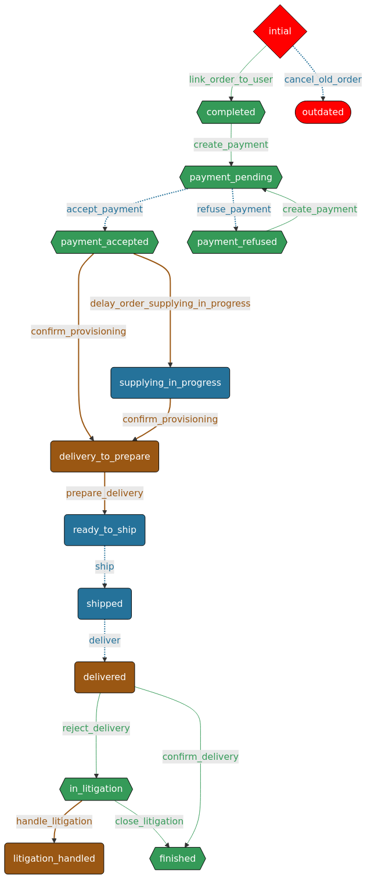

= Fixtures et si on allait au-delà des données
:icons: font
:revealjs_theme: simple
:revealjs_slideNumber: true
:revealjs_history: true
:revealjs_pdfseparatefragments: false
:source-highlighter: highlight.js
:revealjs_width: 1280
:customcss: css/custom.css
:toc:

== Quand vous arrivez sur un projet...

Comment cela se passe-t-il ?

[.columns]
=== L'installation

[.column]
--
image::images/git.png[git,100px]
image::images/npm.png[npm,100px]
image::images/logo-composer-transparent.png[composer,100px]
--

[.column]
--
image::images/docker-compose.png[docker,100px]
image::images/doctrine-logo.svg[doctrine,100px]
--

[NOTE.speaker]
====
* git clone
* build (npm, yarn, composer)
* docker compose up (éventuellement)
* Et après ?
====

=== Et Pour les données, on a ?

[WARNING,step=3]
Le fameux dump et les 1001 commandes...

[TIP,step=1]
La page blanche

[IMPORTANT.fade-up,step=2]
Le bon vieux dump (de prod)

[NOTE.speaker]
====

====

[.columns]
== Qui suis-je ?

[.column]
--
image::images/avatar.png[nico,80%]
--

[.column.has-text-left]
--
**Nicolas**

Développeur PHP, Symfony

TechLead PHP, Architecte
--

[.column]
--

onepoint BDX
--

== Comment générer des données

[%step]
* À la main dans l'interface
* Directement dans la base de données
* Au travers des API
* Fixtures & Object Mother

[NOTE.speaker]
====

. Cela marche, mais c'est long
. Martin Fowler
====

=== "Fixtures" ou "Object Mother" ?

[quote, wikipedia]
____
Une fixture est un morceau de code qui permet de fixer un contexte pour exécuter des tests logiciels.

Ce contexte est un invariant permettant la prédiction des résultats de test.
____

[quote, Martin Fowler]
____
An object mother is a kind of class used in testing to help create example objects that you use for testing.
Pour la suite, nous allons parler de fixture.
____

[NOTE.speaker]
====
* Nom différent
* Mais principe identique
====

=== Quelques exemples de fixtures

[%step]
* Initialiser une base de données ;
* Initialiser un environnement vierge ;
* Copier des données connues à partir de fichiers ;
* Préparer des objets fictifs, des mocks.

=== Et pour les outils

* Django (Python)
* FixtureBuilder ou FactoryBot (Ruby)
* Laravel Factory ou DoctrineFixturesBundle (PHP)
* FixtureFactory (Java)
* Faker ou Factory-girl (Node)

[NOTE.speaker]
====
* Django : Utilise des fixtures pour charger des données initiales dans la base de données.
* Laravel avec Laravel Factory (PHP) - Bien que plus orienté vers les usines, il est utilisé pour générer des données de test.
* Symfony avec DoctrineFixturesBundle (PHP) - Permet de charger des données de test dans la base de données.
* FixtureBuilder (Ruby) - Utilisé pour créer des données de test via code.
* FixtureFactory (Java) est une bibliothèque qui permet de créer facilement des objets de test avec des données prédéfinies.
====

=== Génération de données

Tous ces outils permettent de générer des données
[%step]
* Objets par objets
* Avec des données aléatoires
* Outillent la création d'objets

[%step]
Mais sont très dépendants du code.

[NOTE.speaker]
====
Tous ces frameworks permettent de générer des données, souvent aléatoirement, mais surtout unitairement.

La preuve : si l'on demande à un chat un exemple de fixtures, à chaque fois, il parle de `setUp` et `tearDown`.

Les fakers pour les données aléatoires :

* java-faker
* faker-js
* FakerPHP

====

== Pour que ce soit plus clair

Prenons un exemple d'une librairie en ligne

[%step]

[NOTE.speaker]
====
On pourrait ajouter un front, mais c'est souvent mieux d'imaginer ce que vous voulez
====

=== Nos objets métiers

[%step]
* Des utilisateurs
* Des livres
* Des commandes
* Des commentaires
* ...

[%notitle]
=== Schéma BDD

=== Un client, qu'est-ce que c'est ?

[source, php]
----
$client = new User();
$client->setEmail('test@test.test');
----

[NOTE.speaker]
====
Test => Ok, mais on a besoin de plus de données.
====

=== Un client, c'est aussi

[source, php]
----
$client = new User();
$client->setEmail('test@test.test');
$client->setFirstname('John');
$client->setLastname('Doe');
$client->setRoles([Role::ROLE_CLIENT]);
----

=== Mais aussi, une adresse

[source, php]
----
$address = new Address();
$address->setStreet('1 rue de la paix');
$address->setZipCode('75000');
$address->setCity('Paris');
$address->setLabel('Domicile');
$client->addAddress($address);
----

=== Sans commande, c'est triste

[source, php]
----
$order = new Order();
$order->setClient($client);
$order->setStatus(Order::INITIAL);
$order->setDeliveryAddress(clone $client->getAddresses()[0]);
$order->setBillingAddress(clone $client->getAddresses()[0]);
----

[NOTE.speaker]
====
On a un client, une commande, mais il nous manque un panier
====

=== Il nous faut un panier

[source, php]
----
$cart = new Cart();
$cart->setClient($client);
$order->setCart($cart);
----
[%step]
Qui dit panier, dit livre, un prix, un auteur

[%step]
[source, php]
----
$author = new Author();
$author->setFirstName('John');
$author->setLastName('Doe');

$book = new Book();
$book->setTitle('Le livre');
$book->setAuthor($author);
$book->setPrice(10);

$cartBook = new CartBook();
$cartBook->setBook($book);
$cartBook->setQuantity(1);
$cart->addCartBook($cartBook);
----

=== En plus, nos commandes ont une vie

[%notitle]
=== Workflow

=== Nous avons enfin besoin de :

[%step]
* Un historique à chaque étape
* Des traitements automatiques (paiement, livraison)
* La persistance des données
* Les données temporelles

[NOTE.speaker]
====
Date de création, de paiement, de livraison
====

=== Ne le ferions-nous pas déjà ?

[source, php]
----
function createCart(UserInterface $user, Book $book, int $quantity)
{
    $cart = new Cart();
    $cartBook = new CartBooks();
    $cartBook->setBook($book);
    $cartBook->setQuantity($quantity);
    $cart->addBook($cartBook);

    $this->entityManager->persist($cart);

    $history = new Historique(
        user: $user,
        action: 'create',
        etat: Order::INITIAL,
        comment: 'création panier',
        detailAction: "ajout livre {$book->getTitle()} en quantité {$quantity}"
    );

    $this->entityManager->persist($history);
    $this->entityManager->flush();
}
----

[NOTE.speaker]
====
Handler, Action, Controller, Service, ...
====

[%notitle]
=== Ne le ferions-nous pas déjà ? 2/

On sait créer une commande

[source, php]
----
public function createOrder(UserInterface $user, Book $book, int $quantity): Order
{
    $order = new Order();
    $order->setCart(
        $this->cartService->createCart(user: $user, book: $book, quantity: $quantity)
    );
    $order->setStatus(Order::INITIAL);
    $this->entityManager->persist($order);

    $history = new Historique(
        user: $user,
        action: 'create',
        etat: Order::INITIAL,
        comment: null,
        detailAction: "création de la commande avec le livre {$book->getTitle()} en quantité {$quantity}"
    );
    $this->entityManager->persist($history);

    $this->entityManager->flush();

    return $order;
----

[%notitle]
=== Ne le ferions-nous pas déjà ? 3/

Nous savons créer un client

[source, php]
----
public function createClient(string $firstName, string $lastName, string $email, string $password)
{
    $client = new User();
    $client->setFirstName($firstName);
    $client->setLastName($lastName);
    $client->setEmail($email);
    $client->setRoles([Role::ROLE_CLIENT]);

    $client->setUuid($this->identityService->createUser($client, $password));

    $history = new Historique(
        user: $client,
        action: 'create',
        detailAction: "création du client {$client->getEmail()}"
    );
    $this->entityManager->persist($history);
    $this->entityManager->persist($client);
    $this->entityManager->flush();
}
----

[%notitle]
=== Ne le ferions-nous pas déjà ? 4/

Même un profil de vendeur

[source, php]
----
public function createSeller(string $firstName, string $lastName, string $email, string $password): void
{
    $manager = new User();
    $manager->setFirstName($firstName);
    $manager->setLastName($lastName);
    $manager->setEmail($email);
    $manager->setRoles([Role::ROLE_SELLER]);

    $manager->setUuid($this->identityService->createUser($manager, $password));

    $history = new Historique(
        user: $manager,
        action: 'create',
        detailAction: "création du vendeur {$manager->getEmail()}"
    );
    $this->entityManager->persist($history);
    $this->entityManager->persist($manager);
    $this->entityManager->flush();
}
----

== On va s'outiller un peu

=== Symfony et les fixtures

* FixtureBundle pour la génération de données
* SymfonyClock pour la gestion de l'heure

[NOTE.speaker]
====
Pour la suite de cette présentation, je vais me concentrer sur PHP et le framework Symfony.
Préciser que le principe est transposable sur d'autres frameworks/langages.
====

=== FixtureBundle

[quote, symfony.com - DoctrineFixturesBundle]
____
Fixtures are used to load a "fake" set of data into a database that can then be used for testing or to help give you some interesting data while you're developing your application.
____

=== FixtureBundle

* Permet l'ordonnancement de la création de données
* Fournit un registre de données
* Permet la gestion de l'écrasement des données

[NOTE.speaker]
====

* Jouer différents jeux de données
* Permettre de stocker certaines références pour les réutiliser (un utilisateur spécial, un produit)
* BDD
** Ajout seul
** Purge avec suppression partielle

====

=== SymfonyClock

[%step]
* Remplacement de la fonction now()
* Possibilité de remplacer l'horloge :
** `NativeClock` : date système standard
** `MockClock` : fixe l'heure
** `MonotonicClock` : horloge monotone

[NOTE.speaker]
====
NativeClock pour la prod
MockClock pour les tests
MonotonicClock pour les tests de performances ou le monitoring
====

== Revenons à notre librairie
[NOTE.speaker]
====

Rappeler le contexte

====

=== Racontons donc une histoire

Monsieur Client veut acheter deux exemplaires de "La Roue du Temps".

[.columns]
=== Le parcours de Monsieur Client
[%step]
[.column.has-text-left]
* Il fait son panier, le 29/02/2032 à 10h10,
* Il crée son compte à 10h20,
* Il le complète à 10h30,
* Il paye par virement à 10h40,
* Le paiement est validé le 01/03 à 06h10,

[%step]
[.column.has-text-left]
* La commande est préparée le 03/03 à 06h00,
* La commande est expédiée le 03/03 à 06h30,
* Est enfin livrée le 15/03 à 10h10.
* Il le confirme le soir à 19h00

=== Si on devait le décrire

[source,%linenums, yaml]
----
description: "Monsieur Client veut acheter deux exemplaires de La Roue du Temps"
client:
  email: "monsieur.client@client"
  prenom: "Prénom Test"
  nom: "Nom Test"
  date_creation: "2032-02-29T10:10:00+02:00"
  addresses:
    - adresse1: "numéro, nom de la voie"
      adresse2: "complément adresse"
      commune: "Ville"
      code_postal: "12345"
panier:
    - livre:
          titre: "La Roue du Temps"
          author:
                prenom: "Robert Jordan"
                nom: "Brandon Sanderson"
          prix: 8.95
      quantite: 2
----

[NOTE.speaker]
====
On ne veut pas un objet auteur par livre
Ni d'un livre par panier.
====

=== Réutilisons nos livres et nos auteurs

[source, yaml,highlight=1..3|5..10 ]
----
reference: "AUTEUR_ROBERT_JORDAN"
prenom: "Robert"
nom: "Jordan"

reference: "ROUE_DU_TEMPS_27"
titre: "La Roue du Temps"
auteur: "AUTEUR_ROBERT_JORDAN"
prix: 8.95
isbn: "978-2-266-11111-1"
description: "La Roue du Temps, tome 27, un souvenir de lumière partie 1"

----

=== Maintenant, on les stocke

[%step]
[source, php,%linenums, highlight=7..8|15..16]
----
public function __construct(
    ParameterBagInterface $parameterBag,
    private readonly BookFixtureService $bookService,
)
{
    $this->io = new SymfonyStyle(new ArrayInput([]), new ConsoleOutput());
    $this->authorsDir = $parameterBag->get('app.fixtures.config_scenarii') . '/authors';
    $this->booksDir = $parameterBag->get('app.fixtures.config_scenarii') . '/books';
}
public function load(ObjectManager $manager): void
{
    $finder = new Finder();
    $finder->sortByName(true);

    $this->loadAuthors($finder, $manager, $this);
    $this->loadBooks($finder, $manager, $this);
}
----

=== Ce qui donne

[%step]
[source, php,%linenums,highlight="8|15,21"]
----
public function createAuthor(AppFixtures $fixtures, ObjectManager $manager, array $config): void
{
    $author = new Author();
    $author->setFirstName($config['prenom']);
    $author->setLastName($config['nom']);

    $manager->persist($author);
    $fixtures->addReference($config['reference'], $author);
}

public function createBook(AppFixtures $fixtures, ObjectManager $manager, array $config): void
{
    $book = new Book();
    $book->setTitle($config['titre']);
    $book->setAuthor($fixtures->getReference(name: $config['auteur'], class: Author::class));
    $book->setPrice($config['prix']);
    $book->setIsbn($config['isbn']);
    $book->setDescription($config['description']);

    $manager->persist($book);
    $fixtures->addReference($config['reference'], $book);
}
----

[NOTE.speaker]
====
On passe l'étape de chargement du YAML
====

=== Continuons notre histoire

[source, yaml]
----
description: "Monsieur Client veut acheter deux exemplaires de La Roue du Temps"
client:
  email: "monsieur.client@client"
  prenom: "Prénom Test"
  nom: "Nom Test"
  date_creation: "2032-02-29T10:20:00+02:00"
  addresses:
    -
      adresse1: "numéro, nom de la voie"
      adresse2: "complément adresse"
      commune: "Ville"
      code_postal: "12345"
panier:
  - livre: "ROUE_DU_TEMPS_27"
    quantite: 2
    date_creation: "2032-02-29T10:10:00+02:00"
----

=== Avec des rebondissements
[source, yaml,highlight=2|3..5|6..11]
----
    date_creation: "2032-02-29T10:10:00+02:00"
actions:
  - action: complete
    date: "2032-02-29T10:30:00+02:00"
    user: CLIENT
  - action: pay
    date: "2032-02-29T10:40:00+02:00"
    user: CLIENT
    payload:
      mode_paiement: "transfer"
      iban: "FR1234567890123456789012345"
  - action: confirm_provisioning
----

=== Il faut toujours un 3ᵉ tome
[source, yaml,highlight=2..4|5..7|8..13]
----
      iban: "FR1234567890123456789012345"
  - action: confirm_provisioning
    date: "2032-03-01T06:10:00+02:00"
    user: SELLER
  - action: prepare
    date: "2032-03-03T06:00:00+02:00"
    user: SELLER
  - action: ship
    date: "2032-03-03T06:30:00+02:00"
    user: SYSTEM
    payload:
        transporteur: "La Poste"
        numero_suivi: "12345678901234567890"
  - action: deliver
    date: "2032-03-15T10:10:00+02:00"
    user: SYSTEM
  - action: confirm_delivery
    date: "2032-03-15T19:00:00+02:00"
    user: CLIENT
----

=== Parcourons nos fichiers

[source, php,%linenums,highlight="1..4|5|7..8|10|11..13"]
----
private function loadScenarios(Finder $finder, ObjectManager $manager): void
{
    foreach ($finder->in($this->scenarioDir) as $file) {
        $orderConfig = Yaml::parseFile($file->getRealPath());
        Clock::set(new MockClock($orderConfig['client']['date_creation']));

        $customer = $this->userFixtureService->createCustomer($orderConfig);
        $this->setReference('CLIENT', $customer);

        $order = $this->orderFixtureService->createOrder($manager, $orderConfig, $this);
        foreach ($orderConfig['actions'] as $action) {
            $this->orderFixtureService->executeAction($manager, $this, $action, $order);
        }
        if (!empty($this->errors)) {
            $this->io->error("Les fixtures suivantes sont en erreur :\n - ".implode("\n - ", $this->errors));
        }

        $manager->flush();
    }
}
----

=== Créer une commande en détail

[source, php, %linenums,highlight="3,4,5|6,7,10"]
----
public function createOrder(ObjectManager $manager, array $config, AppFixtures $fixtures): Order
{
    Clock::set(new MockClock($config['panier']['date_creation']));
    $client = $fixtures->getReference('CLIENT', User::class);
    $order = $this->orderService->createOrder(user: $client);
    foreach ($config['panier'] as $cartItem) {
        $this->cartService->addBook(
            user: $client,
            cart: $order->getCart(),
            book: $fixtures->getReference($cartItem['livre'], Book::class),
            quantity: $cartItem['quantite']
        );
    }

    $manager->persist($order);
    $manager->flush();

    return $order;
}
----

=== Et nos actions
[source, php, %linenums,highlight="3,4|6..11"]
----
public function executeAction(ObjectManager $manager, AppFixtures $param, mixed $action, Order $order): void
{
    $user = $param->getReference($action['user'], User::class);
    Clock::set(new MockClock($action['date']));
    match ($action['action']) {
        'complete' => $this->orderService->completeOrder($user, $order),
        'pay' => $this->orderService->configurePayment(order: $order, payload: $action['payload']),
        'confirm_provisioning' => $this->orderService->confirmProvisioning($user, $order),
        'prepare' => $this->orderService->prepareOrder($user, $order),
        'ship' => $this->orderService->shipOrder($user, $order, $action['payload']),
        'deliver' => $this->orderService->deliverOrder($user, $order),
        default => throw new FixtureException(message: 'Action inconnue'),
    };
    $manager->flush();
}
----

== En résumé

image::images/process.svg[process,75%]

=== Nous avons besoin de quoi

[%step]
* Raconter une histoire (YAML)
* Des objets immuables (YAML)
* De parcourir des fichiers (PHP)
* De vérifier un peu (PHP)
* D'orchestrer tout ça (PHP)

=== Pourquoi faire des fixtures

[%step]
* Gagner du temps
* Avoir des données cohérentes
* Donner du contexte à des tests
* Vérifier nos services
* Avoir des données fiables
* Moins coder.

== Merci
