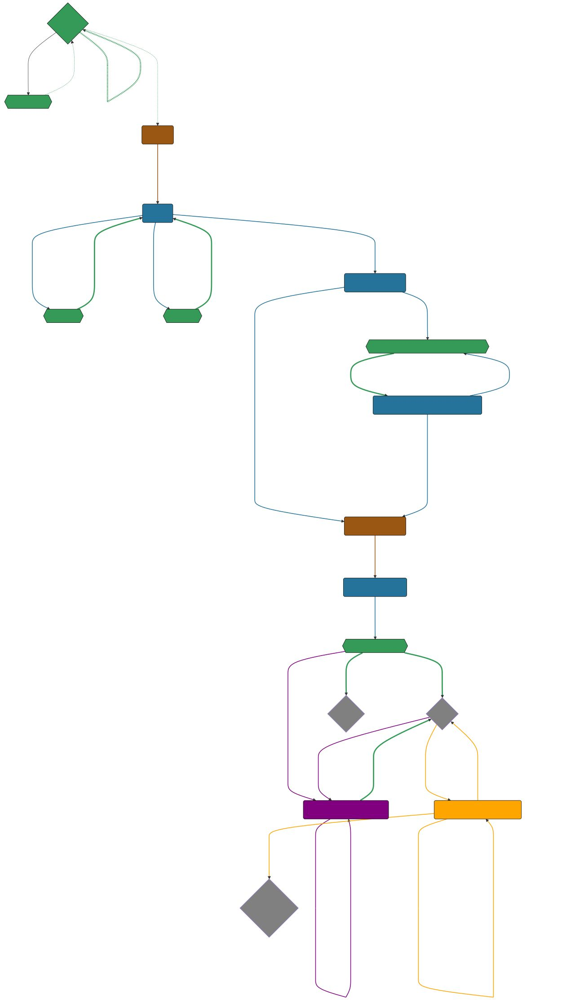

= Fixtures et si on allait au-delà des données
:icons: font
:revealjs_theme: simple
:revealjs_slideNumber: true
:revealjs_history: true
:revealjs_pdfseparatefragments: false
:source-highlighter: highlight.js
:revealjs_width: 1280
:customcss: css/custom.css
:toc:

[NOTE.speaker]
====
Bonjour merci aux organisateurs de me permettre de participer au sud ouest Days.

Aujourd'hui, je vais vous parler de fixtures mais pas que, et si on allait au-delà des données ?

====

== Quand vous arrivez sur un projet...

[NOTE.speaker]
====
Je ne sais pas pour vous, mais en général, pour moi, quand je commence à travailler sur un projet existant.

Cela commence par cela.
====

[.columns]

=== L'installation ...

[.column]
--
image::images/intro/readme.png[readme,100px]
--
[.column]
--
image::images/intro/git.png[git,100px]
--

[step=1]
[.column]
--
image::images/intro/npm.png[npm,100px]
--

[step=1]
[.column]
--
image::images/intro/logo-composer-transparent.png[composer,100px]
--

[step=2]
[.column]
--
image::images/intro/docker-compose.png[docker,100px]
--

[step=2]
[.column]
--
image::images/intro/doctrine-logo.svg[doctrine,100px]
--

[NOTE.speaker]
====
* Je lis le readme, oui oui, c'est intéressant à lire, bon ok pas tout, mais au moins les étapes d'installation.
* Je récupère les sources,
* J'installe les dépendances,
* Je lance les containers ou configure nos briques techniques.
* J'initialise le schéma de base de données et je lance mes migrations
* Et je suis prêt à travailler, enfin presque.

====

[.columns]
=== Et les données ?

[.column]
--
[step=1]
image::images/intro/task.png[task,300px]
--

[.column]
--
[step=2]
image::images/intro/old_hdd.png[task,300px]
--

[.column]
--
[step=4]

--

[.column]
--
[step=3]
image::images/intro/dump_prod.png[dump,300px]
--

[NOTE.speaker]
====

* Intressant le readme,  procédure d'init  en 300 étapes (ou presque).
* le vieux dump qui traine dans un coin
*  le  dump de PROD (anonymisé bien sûr)
* pas de procédure d'anonymisation / ni procédure capilotractée /rien

Pas envie de tout faire à la main, j'ai commencé à essayer de trouver une solution.
Apparemment, fixtures.

Suite REX sur la mise en place de fixtures au sein de mon projet.
====

[.columns]
== Qui suis-je ?

[.column]
--
image::images/avatar.png[nico,80%]
--

[.column.has-text-left]
--
**Nicolas**

Développeur PHP, Symfony

TechLead, Architecte
--

[.column]
--
image::images/gop-mini.png[gop,80px,float="left"]
onepoint BDX
--

== La stack technique

image::images/intro/stack_appli.png[stack]

[NOTE.speaker]
====

Je vous ai dit que l'on était sur un retour d'expérience, posons donc le contexte.

Le projet sur lequel nous travaillons est une application web composée de 3 briques.
* Un backend PHP,
* un front en angular
* une brique d'authentification avec KeyCloak.

Mailpit, on ne prend pas de dump de prod ce n'est pas pour enovoyer des mails
====

=== Contexte

[NOTE.speaker]
====
Cette application gère des demandes d'agrément.

Ne cherchez pas à lire, il n'y a rien de marqué.

Une demande a un cycle de vie complexe, nous avons besoin de mettre en place des jeux de données pour chaque état.

Demande => ajout de fichier => deposer la demande => instruire

====

=== Des demandes et des utilisateurs

* Demandeur
* Demande
* Intervenant

[NOTE.speaker]
====

Demande == Dossier d'information

* l'identité de notre demandeur,
* Qualif / société.
* Fichiers
* Périmètre d'intervention

====

=== l'instruction

image::images/intro/instrution2.png[instruction,40%]

[NOTE.speaker]
====

Une fois un dossier constitué un demandeur va déposer son dossier.

Ces demandes sont instruites par des instructeurs et des superviseurs.

Historique / Audit / Traçabilité

J'ai donc besoin de créer des données pour chacune de ces opérations.

Pour générer tous ces outils, on me parle de fixtures ok c'est quoi
====

== Fixtures

[%step]
[source,php,highlight="1..5|1..3"]
----
$toto = new Toto();

$toto->setToto('truc');

assertEquals($toto->getToto(), 'truc');
----

[NOTE.speaker]
====

Littérature Objet pour les tests

Dans les tests c'est ca une fixture.

Dans Symfony c'est Doctrine Fixtures dont on m'a parlé

Doctrine === ORM
====

=== FixtureBundle

[source,php,%linenums,highlight="1..3|7..8|1..10"]
----
class AppFixtures extends Fixture
{
    public function load(ObjectManager $manager): void
    {
        $objet = new Object();

        $this->addReference("reference", $objet);
        $this->getReference("reference", $objet::class);
    }
}
----
[NOTE.speaker]
====

* Exécution load des classes fixtures
* manager = bdd
* Registre de référence => partage

====
=== FixtureBundle

[source,php,%linenums,highlight="1|3..6|1..7]
----
class AppFixtures extends Fixture implements DependentFixtureInterface
{
    public function getDependencies(): array
    {
        return [];
    }
}
----
[NOTE.speaker]
====

* DependentFixtureInterface
* getDependencies == ordonnancement

====

=== Première fixture

[source, php,%linenums,highlight="1..4|5..9|11 ..12|14|1..14"]
----
class AppFixturesBasis extends Fixture
{
    public function load(ObjectManager $manager): void
    {
        $demandeur = new Demandeur();
        $demandeur->setEmail('test@test.test');
        $demandeur->setFirstname('John');
        $demandeur->setLastname('Doe');
        $demandeur->setRoles([Role::ROLE_DEMANDEUR->name]);

        $manager->persist($demandeur);
        $manager->flush();

        $this->addReference('DEMANDEUR', $demandeur);
    }
}
----

[NOTE.speaker]
====

Données -> persistance ->reference

Demandeur != candidat
demandeur == pas dans keycloak

=> Notion de candidat.

====

=== Créons donc un Candidat.

[source, php,%linenums,highlight="3|5..10|11"]
----
public function load(ObjectManager $manager): void
{
    $candidate = new Candidate();

    $candidate->setFirstName("John");
        ->setLastName("Doe")
        ->setEmail("john.doe@test.test")
        ->setSiren("123456789")
        ->setName("Société")
        ->setPassword("motDePasse");
    $this->candidateService->create($candidate);
}
----

[NOTE.speaker]
====
Maintenant, on a un candidat, mais surtout un candidat avec lequel on pourra se connecter dans l'application.

Candidate Service :

* Création d'un utilisateur dans Keycloak
* Sauvegarde en bdd
* Envoi du mail d'activation du compte
* Création d'un historique de création
====

=== La notion de périmètre

[%step]
[source, php,%linenums,highlight="1..9|1,9..18"]
----
class GeographicDataFixtures extends Fixture
{
    public function load(ObjectManager $manager): void
    {
        $this->departementRegionCommand->execute($this->input, $this->output);
        $this->epcisCommand->execute($this->input, $this->output);
        $this->communesCommand->execute($this->input, $this->output);
    }
}

class AppFixtures extends Fixture
{
    public function getDependencies(): array
    {
        return [
            GeographicDataFixtures::class,
        ];
    }
----

[NOTE.speaker]
====
On a parlé de demande, et de périmètre d'une demande.
Elles sont où les données géographiques ?

Heureusement, nous avons une commande qui permet de créer des communes, des départements et des régions.

On a donc un candidat, mais il nous faut également des instructeurs.
====

=== Les intervenants

[source,php,%linenums,highlight="1..8|12|13..19|20|21|1..21"]
----
class IntervenantFixtures extends Fixture implements DependentFixtureInterface
{
    public function getDependencies(): array
    {
        return [
            GeographicDataFixtures::class,
        ];
    }

    public function load(ObjectManager $manager): void
    {
        foreach ($this->departementRepository->findAll() as $departement) {
            $instructeur = new Intervenant();
            $email = "instructeur_{$dpt->getCode()}@test.test";
            $instructeur->setFirstName('Instructeur')
                ->setLastName($departement->getNom())
                ->setEmail($email)
                ->setRoles([Role::ROLE_INSTRUCTEUR->name])
                ->setPerimetreSupervision((new PerimetreIntervention())->addDepartement($dpt));
            $this->intervenantService->create($instructeur);
            $this->addReference('INSTRUCTEUR_' . $dpt->getCode(), $instructeur);
        }
    }
}
----

[NOTE.speaker]
====

Comme pour les demandeurs, nous avons des services pour créer les instructeurs.
et nous allons créer des superviseur.

* Dépendant géo
* On parcourt tous les départements, on crée un instructeur par département.
* serviceCreateInstructeur ==  (Keycloak / histo)
* Stockage de la référence
* On prendra ensuite un principe similaire en parcours les régions pour créer des superviseurs.
====

=== Les intervenants

[source,php,%linenums,highlight="1|6,7|1..9"]
----
class DemandeFixtures extends Fixture implements DependentFixtureInterface
{
    public function getDependencies(): array
    {
        return [
            GeographicDataFixtures::class,
            IntervenantFixtures::class,
        ];
    }

----

[NOTE.speaker]
====
Pour les demandes, nous avons besoin d'instructeurs rendons les dépendants.
====

=== Passons donc aux demandes

[source, php,%linenums,highlight="1..3|5..21|23|1..23"]
----
$candidate = $this->creeDemandeur("John", "Doe", "john.doe@test", "123456789", "Société", "motDePasse");
$candidate->getUser()->setRoles([Role::ROLE_DEMANDEUR->name]);
$commune = $this->communeRepository->findOneBy(['nom' => 'Bordeaux']);

$param = [
    'demandeur' => [
        'tel' => '+33600000000',
        'company' => [
            'creationDate' => '2024-01-01',
            'formeJuridique' => 'autres',
            'perimetreIntervention' => ['departement' => $commune->getDepartement()->getNom()],
        ],
    ],
    'adresse' => [
        'adresse1' => 'numéro, nom de la voie',
        'adresse2' => 'complément adresse',
        'codePostal' => $commune->getCodePostaux()[0],
        'codeDepartement' => $commune->getDepartement()->getCode(),
        'ville' => $commune->getNom(),
    ],
];

return $this->demandeService->creeDemande($demandeur, $param);
----

[NOTE.speaker]
====

Une demande, c'est beaucoup d'informations, mais dans notre cas ce qui nous intéresse c'est le périmètre de la demande.

Là encore, on pourrait créer tous les objets, mais on a un service qui nous permet cela.

Nous utilisons le service pour créer notre demande.
====

[.columns]
=== La problématique des fichiers

[.column]
--
image::images/logo_pdf.png[logo_pdf,200px]
image::images/fichier_bash.png[fichier]
--

[.column]
--

--

[NOTE.speaker]
====

* Demande === *BEAUCOUP* de fichiers.
* Fichier === stockage sur disque et pas *que* en bdd
* Download ?

Le contenu du fichier, on s'en moque un peu, il faut qu'il y en ait un pour que l'on puisse les manipuler dans l'application.

====

=== La problématique des fichiers

[source,php,%linenums,highlight="1..9|16..22|15|10..14|1..24"]
----
public function createUploadedFile(string $nom): UploadedFile
{
    $this->filesystem->copy(
        originFile:'/var/www/html/src/DataFixtures/test_files/test.pdf',
        targetFile: "/tmp/$nom",
        overwriteNewerFiles: true);

    return new UploadedFile("/tmp/$nom", $nom, 'application/pdf', test: true);
}
public function addPjsBrouillon(
    DemandeAgrement $demande,
    string $nom,
    string $codeTypePj,
): PieceJointe {
    return $this->pieceJointeService->createPieceJointe(
        new PieceJointeModel(
            nom: $nom,
            fichier: $this->fixtHelpers->createUploadedFile($nom),
            demande: $demande,
            user: $demande->getDemandeur(),
            codeTypePj: $codeTypePj
        )
    );
}

----

[NOTE.speaker]
====

Un fichier téléversé, c'est un UploadedFile
 * dans /tmp avec un nom

* modele PJ
* appelle service (histo, stockage sur disque, téléchargement ...)
* Encapsulage dans une fonction

On a donc une fonction qui permet de créer un fichier qui pourra être manipulé par notre application.

====

=== Demandes & fichiers

[source,php,%linenums]
----
$demande = $this->getReferece('DEMANDE', Demande::class);

foreach (Demande::Procedure as $typePj) {
    $this->fixtureService->addPjsBrouillon($demande, "test_{$type}.pdf", $typePj->code());
}
----

[NOTE.speaker]
====

Demande == beaucoup de fichiers.

L'utilisateur télécharge les fichiers un à un par demande dans le parcours de création.
Nous connaissons les types de fichiers nécesaires pour une demande.
Notre demande est donc complète.
====

=== Ce n'est que le début de l'histoire

image::images/workflow_mar_complet.svg[workflow,30%]

[NOTE.speaker]
====
Ce n'est pas lisible
====

=== Ce n'est que le début de l'histoire

image::images/workflow_mar_simplifie.svg[workflow,100%]

[NOTE.speaker]
====
Toujours pas
====

=== Ce n'est que le début de l'histoire

[NOTE.speaker]
====

C'est mieux ?

* Vert => demandeur
* Orange/Marron => Superviseur
* Bleu => Instructeur

Brouillon => Déposée => Affectée <=> Incomplete => Complete

====

=== Dépôt d'une demande

[source,php]
----
$demande = $this->getReferece('DEMANDE', Demande::class);
$demandeur = $this->getReferece('DEMANDEUR', Demandeur::class);

$this->demandeService->deposer(user: $demandeur, demande: $demande);
----

[NOTE.speaker]
====
Action simple, besoin d'une demande d'un demandeur.
Par contre l'action de déposer une demande va déclencher une série d'événements.
====

=== Dépôt d'une demande

image::images/depose_diagram.svg[depose]

[NOTE.speaker]
====

* validation payload
* transition
* bdd
* histo
* mail instructeur & demandeur

====

=== Demande de complément et réponse

=== Et on continue le parcours

[source,php,%linenums,highlight="1..4|6|8|10..13|15|1..15"]
----
$demande = $this->getReferece('DEMANDE', Demande::class);
$demandeur = $this->getReferece('DEMANDEUR', Demandeur::class);
$instructeur = $this->getReferece('INSTRUCTEUR_33', Intervenant::class);
$superviseur = $this->getReferece('SUPERVISEUR_75', Intervenant::class);

$this->demandeService->affecterDemande(user: $superviseur, demande: $demande, instructeur: $instructeur);

$this->demandeService->demanderComplément(user: $instructeur, demande: $demande, commentaire: 'Commentaire');

$this->demandeService->addPjsBrouillon($demande, "complement1.pdf", "complement");
$this->demandeService->addPjsBrouillon($demande, "complement2.pdf", "complement");

$this->demandeService->donnerComplement(user: $demandeur, demande: $demande);

$this->demandeService->confirmerCompletude(user: $instructeur, demande: $demande);
----
[NOTE.speaker]
=====

* Récup demandeur & intervenant
* Affectation Superviseur, instructeur et demande
* Demande de complément instructeur & commentaire
* donner complément fichier + action simple
* confirmer complétude simple instructeur

=====

=== Et on continue le parcours

[NOTE.speaker]
====

* Données OK
* Connexion OK
* fichiers OK
* Consulation OK
* Historisque bof

Le demandeur à déposé 25 fichiers, l'instructeur les a contrôlé et a demandé des compléments, le demandeur a répondu et l'instructeur a confirmé la complétude.
Le tout a 1,3 seconde.
Pas très réaliste.
====

== Il est temps de voyager

image::images/delorean3.png[delorean]

[NOTE.speaker]
====

 Ca existe de forcer une date dans Symfony ?
====

=== SymfonyClock

[source, php]
----
use function Symfony\Component\Clock\now;

// Get the current time as a DatePoint instance
$now = now();

Clock::set(new MockClock("2024-01-01"));
Clock::set(new NativeClock());
----

[NOTE.speaker]
====
SymfonyClock est une librairie qui permet de gérer le temps dans nos tests.
On peut donc fixer le temps à une date précise. (MockClock) ou utiliser le temps réel (NativeClock).

Avec MockClock, on a tout ce qu'il nous faut pour rendre notre cas de test réaliste.
====

=== Figeons le temps

[source,php,%linenums,highlight="1..2|1,4,7,10,13|1..14"]
----
Clock::set(new MockClock("2024-06-01"));
$this->demandeService->affecterDemande(user: $superviseur, demande: $demande, instructeur: $instructeur);

Clock::set(new MockClock("2024-06-08"));
$this->demandeService->demanderComplément(user: $instructeur, demande: $demande, commentaire: 'Commentaire');

Clock::set(new MockClock("2024-06-16"));
$this->demandeService->addPjsBrouillon($demande, "complement1.pdf", "complement");

Clock::set(new MockClock("2024-07-01"));
$this->demandeService->addPjsBrouillon($demande, "complement2.pdf", "complement");

Clock::set(new MockClock("2024-07-22"));
$this->demandeService->donnerComplement(user: $demandeur, demande: $demande);
----

[NOTE.speaker]
====

* 6 juin = affectation
* 8 juin = demande de complément
* 16 juin = ajout de fichier
* 1er juillet = ajout de fichier
* 22 juillet = donner complément

On peut maintenant fixer le temps pour chaque action.
Réaliste

====

=== Figeons le temps

[source,php,%linenums,highlight="1..5|7..8|10,11|1..11"]
----
Clock::set(new MockClock("2024-07-23"));
$this->demandeService->affecterDemande(user: $superviseur, demande: $demande, instructeur: $instructeur);

Clock::set(new MockClock("2024-07-31"));
$this->demandeService->demanderComplément(user: $instructeur, demande: $demande, commentaire: 'Commentaire');

Clock::set(new MockClock("2024-09-01"));
$this->demandeCommand->checkDelaiReponse();

Clock::set(new MockClock("2024-09-02"));
$this->demandeService->refuserDemande(user: $instructeur, demande: $demande, commentaire: 'Hors délai');
----

[NOTE.speaker]
====

* 23 juillet = affectation
* 31 juillet = demande de complément
* 1er septembre = vérification délai
* 2 septembre = refus de la demande

Sans bidouiller impossilbe

====

[.columns.is-vcentered]
=== En résumé
[%step]
[.column]
--
Données géographiques

Intervenant
--

[%step]
[.column]
--
Demandeur

Fichiers

Demandes
--

[%step]
[.column]
--
Le temps
--

[NOTE.speaker]
====
Nous avons pu alimenter les données de base (géographique notamment).
Créer nos intervenants (instruteur, superviseur et admin).

On a un cas de test réaliste avec des utilisateurs qui peuvent se connecter (Demandeur, instructeur, superviseur).
Nous avons des fichiers que les utilsateurs peuvent consulter et donc vérifier leur présence.
On a pu créer nos données de manière cohérente.
Créer nos demandes

Gérer la temporalité des actions.

====

== Outillons-nous

[%step]
image::images/process2.svg[30%]

[NOTE.speaker]
====
Par contre, on a fait que coder
Mon besoin principal est de créer des données pour tous les états d'une demande.
Je ne veux pas avoir à tout écrire à la main.
Code == TU

Nous allons donc voir comment nous pouvons outiller tout cela.

* Données nécessaires : utilisateurs / données géographiques
* Parcours fichier : un scénario par demande
* Mise en place de la gestion de scénario
====

=== Ecrivons un scénario

[%step]
"*John Doe* dépose une demande d'agrément, qui est instruite par un *instructeur* et un *superviseur*."
-- Qui fait quoi

[%step]
"John Doe dépose une demande d'agrément *sur la gironde* qui est instruite par l'instructeur *Gironde* et le superviseur *Nouvelle Aquitaine*."
-- que fait-on

[%step]
"John Doe dépose une demande d'agrément le *20 janvier* sur la gironde qui est instruite *le 15 février* par l'instructeur Gironde et le superviseur Nouvelle Aquitaine, *le premier mars*"
-- Quand le fait-on ?

[NOTE.speaker]
====
La première étape, c'est de savoir qui fait l'action.

Une information discriminante est également le périmètre de l'agrément.

Et enfin de savoir quand on fait l'action

Par contre il y a beacoup d'information qui ont du sens pour un instructeur mais n'ont pas de sens pour nous.
====

=== Décrivons cette histoire

[%step]
[source,%numlines,yaml,highlight="1..23|2,5,7,11,17|18..21|22,23"]
----
demandeur:
  email: "john.doe@test"
  prenom: "John"
  nom: "Doe"
  date_creation: "20/01/2023"
  telephone: "+33612345678"
qualite: "qualite"
societe:
  nom_societe: "MaSociete ÔSiren"
  email: "company@boite.mail"
  siren: "123456789"
  telephone: "+33612345678"
  forme_juridique: "autres"
adresse:
  adresse1: "numéro, nom de la voie"
  adresse2: "complément adresse"
  commune: "Bordeaux"
perimetre_intervention:
  departements: [33]
  regions: []
  precisions: ""
date_creation: "2023-01-20T10:00:00+02:00"
date_modification: "2023-01-20T12:00:00+02:00"
----

[NOTE.speaker]
====

Introduire le yaml (facile à lire, facile à écrire, facile à parser)

Nous n'avons besoin que de toutes ces données.

Certaines données sont importantes pour l'instruction pas pour noous

Demandeur :

* mail
* date,
* qualité
* siren
* commune
====

=== Il manque un pitch

[source,%numlines,yaml,highlight="2..13|1|8..9|1..13"]
----
description: "Mon premier cas de test"
demandeur:
  email: "john.doe@test"
  date_creation: "2023-01-20T10:00:00+02:00"
societe:
  siren: "123456789"
  commune: "Bordeaux"
perimetre_intervention:
  departements: [33]
qualite: "qualite"
date_creation: "2023-01-20T10:00:00+02:00"
date_modification: "2023-01-20T10:00:00+02:00"
----

[NOTE.speaker]
====

Scénar faut un pitch

On peut par contre ajouter une description : savoir ce que fait le cas de test.

Même un périmètre d'intervention peut être limité aux données nécessaires. absence == tableau vide

====

=== Traitons notre scénario

[source, php,%numlines,highlight="1..4|6..8|10..14"]
----
$demandeConfig = Yaml::parseFile($file->getRealPath());
$description = "\n  - {$demandeConfig['description']}" : '';
$user = "\n  - Demandeur : {$demandeConfig['demandeur']['email']}";
$this->io->info("Traitement fichier : {$file->getFilename()} $user $description ");

Clock::set((new MockClock($demandeConfig['demandeur']['date_creation']))->withTimeZone('Europe/Paris'));
$demandeur = $this->demandeurFixturesService->createDemandeur($demandeConfig);
$this->setReference('DEMANDEUR', $demandeur);

Clock::set((new MockClock($demandeConfig['date_creation']))->withTimeZone('Europe/Paris'));
$demande = $this->demandeFixturesService->createDemande($demandeConfig, $demandeur);

Clock::set((new MockClock($demandeConfig['date_modification']))->withTimeZone('Europe/Paris'));
$this->demandeFixturesService->completeDemande($demande);
----

[NOTE.speaker]
====

* Récupération et affichage de ce que l'on fait description et demandeur.
* Création demandeur & stockage de la référence Mettre l'attention sur la référence
* Création de la demande on a un service pour ajouter les données par défaut, mais sinon on utilise l'appli
* L'étape de completude sert à ajouter tous les fichiers nécessaires à la demande.

====

=== Action!

[source.yaml,%numlines,highlight="1|2..5|6..9|10,11|6..11|13..17|19..23,25..27"]
----
actions:
  -
    user: DEMANDEUR
    action: DEPOSER
    date: '2024-01-14T10:00:00+02:00'
  -
    user: SUPERVISEUR_75
    action: AFFECTER_INSTRUCTEUR
    date: '2024-01-16T08:00:00+02:00'
    payload:
      instructeur: 'INSTRUCTEUR_33'
  -
    user: INSTRUCTEUR_33
    action: DEMANDER_COMPLEMENT
    date: '2024-01-18T18:00:00+02:00'
    payload:
      commentaire: 'Demande de complément'
  -
    user: DEMANDEUR
    action: AJOUT_FICHIER
    date: '2024-01-25T10:00:00+02:00'
    payload:
      file_name: 'complement_pj1.pdf'
  -
    user: DEMANDEUR
    action: DONNER_COMPLEMENT
    date: '2024-01-25T10:15   :00+02:00'
----

[NOTE.speaker]
====

* Depose
* affectation + instructeur
* Demande de complément
* Ajout de fichier & donner complément

====

=== Gestion des actions

[source,php,%numlines,highlight="1..3|4..9|1..11"]
----
public function parcoursAction(array $demandeConfig, Demande $demande): void
{
    foreach ($demandeConfig['actions'] as $action) {
        $user = $action['user'];
        match ($action['action']) {
            'depose' => $this->demandeService->depose($user, $demande),
            'affecte' => $this->demandeService->affecte($user, $demande, $action['payload']),
            'complete' => $this->demandeService->complete($user, $demande),
        };
    }
}
----

[%notitle]
=== Schéma

image::images/process.svg[process,70%]

[NOTE.speaker]
====
Nous pouvons donc simplement écrire des scénarios pour tous les états d'une demande.
====

=== Détails d'un scénario.

image::images/process_final.svg[process_final,70%]

[NOTE.speaker]
====
* Contrôle des données
* L'application sait quand c'est faux.
* Création d'un scénario par défaut
====

[%notitle]
=== scenario_par_defaut

[source,yaml,%numlines,highlight="1..28|1,3,6,15,21,23..28"]
----
description: '<a_modifier>'
demandeur:
  email: "<a_modifier>"
  prenom: "Prénom Test"
  nom: "Nom Test"
  date_creation: "<a_modifier>"
  telephone: "+33612345678"
signataire:
  nom: "Nom Signataire"
  prenom: "Prénom Signataire"
  qualite: "signataireQuality"
societe:
  nom_societe: "MaSociete ÔSiren"
  email: "company@boite.mail"
  siren: "<a_modifier>"
  telephone: "+33612345678"
  forme_juridique: "autres"
adresse:
  adresse1: "numéro, nom de la voie"
  adresse2: "complément adresse"
  commune: "<a_modifier>"
perimetre_intervention:
  departements: "<a_modifier>"
  regions: "<a_modifier>"
  precisions: "<a_modifier>"
qualite: "<a_modifier>"
date_modification: "<a_modifier>"
date_creation: "<a_modifier>"
----

[NOTE.speaker]
====

* Valider les données obligatoires absence = erreur
* Remplir les données non saisies

====

== Et si on allait encore plus loin

[NOTE.speaker]
====
Et oui, j'ai prévenu nous voulons être beyond.

====

=== Et les mots de passes...

[%step]

**1A**john.doe@test

[NOTE.speaker]
====

Keycloak mail == mail il aime pas

On a donc choisi 1A+mail
====

=== Une nouvelle action ?

[NOTE.speaker]
====

Nous invoke, rien à faire,

Au pire il faut juste gérer l'aiguillage vers le service.

====

=== Ça ne fait pas le café, mais presque !

[NOTE.speaker]
====
On a donc un outil qui nous permet de générer des données pour tous les états d'une demande.

Pas direct, on a suivi un parcours.

On a ajouté des cas de tests supplémentaires.

Context pour les tests, Mais le contexte est partiellement testé.

====

=== On a perdu la recette

[NOTE.speaker]
====

La base de données à été effacée
6 mois de cas de tests perdus

Ce n'est pas que pour la dev,
====

=== Un film, on en fait la promo.

|===
|Demandeur | Superviseur | Instructeur | Périmètre | etat | Fichier de fixtures

| cas-1@test | superviseur_75@test | instructeur_24@test | Dordogne | agree | scenario_1.yml
| cas-2@test | superviseur_75@test | instructeur_33@test | Nouvelle-Aquitaine, Occitanie | refuse | scenario_2.yml
| cas-3@test | superviseur_75@test | instructeur_33@test | Nouvelle-Aquitaine, Occitanie | incomplete | scenario_3.yml
| cas-4@test | superviseur_75@test |  | Landes, Lot & Garonne, Hautes-Pyrénées, Pyrénées Atlantiques | deposee | scenario_4.yml
|===

[soure,asciidoc]
----
|===
|Demandeur | Superviseur | Instructeur | Périmètre | etat | Fichier de fixtures

| cas-1@test | superviseur_75@test | instructeur_24@test | Dordogne | agree | scenario_1.yml
|===
----

[NOTE.speaker]
====

On a des descriptions et des informations discriminates sur un scénario.

Générons la documentation, si ca reste dans le code personne ne l'utilise.

Gitlab pages, confluence ou autre

C'est de AsciiDoc et les informations ont les a dans les fichiers yaml

====

=== Vers une histoire collaborative.

[NOTE.speaker]
====

* Un cas à reproduire en prod
* Du contexte pour les testeurs
* Des scénarios pour les tests auto
* Contexte = données prédictibles pain béni pour les tests.

Comme on a fait une bonne promo tout le monde veut en faire.

Oui, c'est généré par IA il y a des pieds à la place des mains
des gens très souples

====

== Conclusion

[NOTE.speaker]
====

Doctrine n'existe pas ? Créez le principe. Une commande, un registre et zou.

Un peu de code au début pour écrire un scénario, mais on peut commencer petit

* testeurs
* développeurs
* product owner

Vos collègues vont vous aimer.

====

[.columns.is-vcentered]
== Merci

[.column]
--
Slides

--

[.column]
--
Nicolas guérinet

image::images/avatar.png[nico,200px]
--

[.column]
--

Feedback

--

[NOTE.speaker]
====
J'espère que cette présentation vous aura plus.

* lien slide
* lien feedback

====