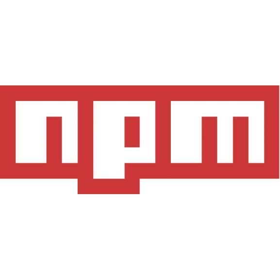

== Quand vous arrivez sur un projet...

[NOTE.speaker]
====
Je ne sais pas pour vous, mais en général, pour moi, quand je commence à travailler sur un projet existant.

Cela commence par cela.
====

[.columns]

=== L'installation ...

[.column]
--
image::images/intro/readme.png[readme,100px]
--
[.column]
--
image::images/intro/git.png[git,100px]
--

[step=1]
[.column]
--

--

[step=1]
[.column]
--
image::images/intro/logo-composer-transparent.png[composer,100px]
--

[step=2]
[.column]
--
image::images/intro/docker-compose.png[docker,100px]
--

[step=2]
[.column]
--
image::images/intro/doctrine-logo.svg[doctrine,100px]
--

[NOTE.speaker]
====

* Readme, interressant sur l'install
* Git, je clone le projet
* dépendances back et front
* init bdd & migration
* let's go

====

[.columns]
=== Et les données ?

[.column]
--
[step=1]
image::images/intro/task.png[task,300px]
--

[.column]
--
[step=2]

--

[.column]
--
[step=4]
image::images/intro/404.png[404,600px]
--

[.column]
--
[step=3]
image::images/intro/dump_prod.png[dump,300px]
--

[NOTE.speaker]
====

* Readme init / proc install longue
* vieux dump
* prod anonymisée ^^
* RIEN

Flemme de faire à la main, solution apparemment fixtures.

Rex sur le projet
====
