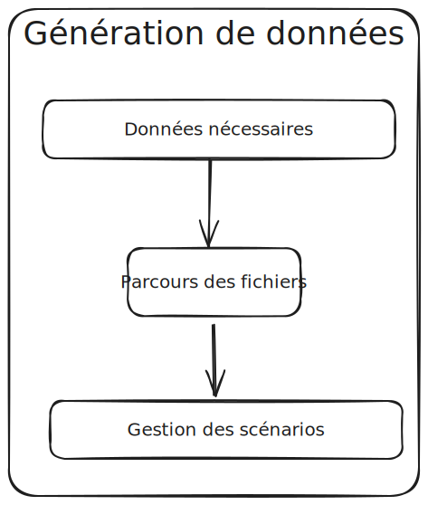
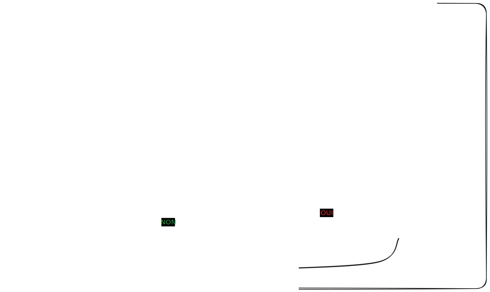

== Outillons-nous

[NOTE.speaker]
====

On a fait que coder.

Besoin : créer des données pour tous les états d'une demande.

Je ne veux pas avoir à tout écrire à la main pour chaque cas.

Code == TU
====

[%notitle]
=== Générons des données

[NOTE.speaker]
====

* Données nécessaires : utilisateurs / données géographiques
* Parcours fichier : un scénario par demande
* Mise en place de la gestion de scénario
====

=== Ecrivons un scénario

[%step]
"*John Doe* dépose une demande d'agrément, qui est instruite par un *instructeur* et un *superviseur*."
-- Qui fait quoi

[%step]
"John Doe dépose une demande d'agrément *sur la gironde* qui est instruite par l'instructeur *Gironde* et le superviseur *Nouvelle Aquitaine*."
-- que fait-on

[%step]
"John Doe dépose une demande d'agrément le *20 janvier* sur la gironde qui est instruite *le 15 février* par l'instructeur Gironde et le superviseur Nouvelle Aquitaine, *le premier mars*"
-- Quand le fait-on ?

[NOTE.speaker]
====
La première étape, c'est de savoir qui fait l'action.

Une information discriminante est également le périmètre de l'agrément.

Et enfin de savoir quand on fait l'action

Par contre il y a beacoup d'information qui ont du sens pour un instructeur mais n'ont pas de sens pour nous.
====

=== Décrivons cette histoire

[%step]
[source,yaml,highlight="1..22|2,6,10,16|17..20|21,22"]
----
demandeur:
  email: "john.doe@test"
  prenom: "John"
  nom: "Doe"
  telephone: "+33612345678"
qualite: "qualite"
societe:
  nom_societe: "MaSociete ÔSiren"
  email: "company@boite.mail"
  siren: "123456789"
  telephone: "+33612345678"
  forme_juridique: "autres"
adresse:
  adresse1: "numéro, nom de la voie"
  adresse2: "complément adresse"
  commune: "Bordeaux"
perimetre_intervention:
  departements: [33]
  regions: []
  precisions: ""
date_creation: "2023-01-20T10:00:00+02:00"
date_modification: "2023-01-20T12:00:00+02:00"
----

[NOTE.speaker]
====

Introduire le yaml (facile à lire, facile à écrire, facile à parser)

Nous n'avons besoin que de toutes ces données.

Certaines données sont importantes pour l'instruction pas pour noous

Demandeur :

* mail
* qualité
* siren
* commune
* date
====

=== Il manque un pitch

[source,%numlines,yaml,highlight="2..12|1|7..8|1..12"]
----
description: "Mon premier cas de test"
demandeur:
  email: "john.doe@test"
societe:
  siren: "123456789"
  commune: "Bordeaux"
perimetre_intervention:
  departements: [33]
qualite: "qualite"
date_creation: "2023-01-20T10:00:00+02:00"
date_modification: "2023-01-20T10:00:00+02:00"
----

[NOTE.speaker]
====

Scénar faut un pitch

On peut par contre ajouter une description : savoir ce que fait le cas de test.

Même un périmètre d'intervention peut être limité aux données nécessaires. absence == tableau vide

====

=== Traitons notre scénario

[source, php,%numlines,highlight="1..4|6..8|10..14"]
----
$demandeConfig = Yaml::parseFile($file->getRealPath());
$description = "\n  - {$demandeConfig['description']}" : '';
$user = "\n  - Demandeur : {$demandeConfig['demandeur']['email']}";
$this->io->info("Traitement fichier : {$file->getFilename()} $user $description ");

Clock::set((new MockClock($demandeConfig['demandeur']['date_creation'])));
$demandeur = $this->demandeurFixturesService->createDemandeur($demandeConfig);
$this->setReference('DEMANDEUR', $demandeur);

Clock::set((new MockClock($demandeConfig['date_creation'])));
$demande = $this->demandeFixturesService->createDemande($demandeConfig, $demandeur);

Clock::set((new MockClock($demandeConfig['date_modification'])));
$this->demandeFixturesService->completeDemande($demande);
----

[NOTE.speaker]
====

* Récupération et affichage de ce que l'on fait description et demandeur.
* Création demandeur & stockage de la référence Mettre l'attention sur la référence
* Création de la demande on a un service pour ajouter les données par défaut, mais sinon on utilise l'appli
* L'étape de completude sert à ajouter tous les fichiers nécessaires à la demande.

====

[%notitle]
=== Action!

[source.yaml,%numlines,highlight="1|2..5|6..9|10,11|6..11|13..17|19..23,25..27"]
----
actions:
  -
    user: DEMANDEUR
    action: DEPOSER
    date: '2024-01-14T10:00:00+02:00'
  -
    user: SUPERVISEUR_75
    action: AFFECTER_INSTRUCTEUR
    date: '2024-01-16T08:00:00+02:00'
    payload:
      instructeur: 'INSTRUCTEUR_33'
  -
    user: INSTRUCTEUR_33
    action: DEMANDER_COMPLEMENT
    date: '2024-01-18T18:00:00+02:00'
    payload:
      commentaire: 'Demande de complément'
  -
    user: DEMANDEUR
    action: AJOUT_FICHIER
    date: '2024-01-25T10:00:00+02:00'
    payload:
      file_name: 'complement_pj1.pdf'
  -
    user: DEMANDEUR
    action: DONNER_COMPLEMENT
    date: '2024-01-25T10:15   :00+02:00'
----

[NOTE.speaker]
====

* Depose
* affectation + instructeur
* Demande de complément
* Ajout de fichier & donner complément

====

=== Gestion des actions

[source,php,%numlines,highlight="1..3|4..9|1..11"]
----
public function parcoursAction(array $demandeConfig, Demande $demande): void
{
    foreach ($demandeConfig['actions'] as $action) {
        $user = $action['user'];
        match ($action['action']) {
            'depose' => $this->demandeService->depose($user, $demande),
            'affecte' => $this->demandeService->affecte($user, $demande, $action['payload']),
            'complete' => $this->demandeService->complete($user, $demande),
        };
    }
}
----

[%notitle]
=== Schema

image::images/process.svg[process,90%]

[NOTE.speaker]
====
Nous pouvons donc simplement écrire des scénarios pour tous les états d'une demande.
====

[%notitle]
=== Gestion scénario

[NOTE.speaker]
====
* Contrôle des données
* L'application sait quand c'est faux.
* Création d'un scénario par défaut
====

[%notitle]
=== scenario_par_defaut

[source,yaml,%numlines,highlight="1..28|1,3,6,15,21,23..28"]
----
description: '<a_modifier>'
demandeur:
  email: "<a_modifier>"
  prenom: "Prénom Test"
  nom: "Nom Test"
  date_creation: "<a_modifier>"
  telephone: "+33612345678"
signataire:
  nom: "Nom Signataire"
  prenom: "Prénom Signataire"
  qualite: "signataireQuality"
societe:
  nom_societe: "MaSociete ÔSiren"
  email: "company@boite.mail"
  siren: "<a_modifier>"
  telephone: "+33612345678"
  forme_juridique: "autres"
adresse:
  adresse1: "numéro, nom de la voie"
  adresse2: "complément adresse"
  commune: "<a_modifier>"
perimetre_intervention:
  departements: "<a_modifier>"
  regions: "<a_modifier>"
  precisions: "<a_modifier>"
qualite: "<a_modifier>"
date_modification: "<a_modifier>"
date_creation: "<a_modifier>"
----

[NOTE.speaker]
====

* Valider les données obligatoires absence = erreur
* Remplir les données non saisies

====
