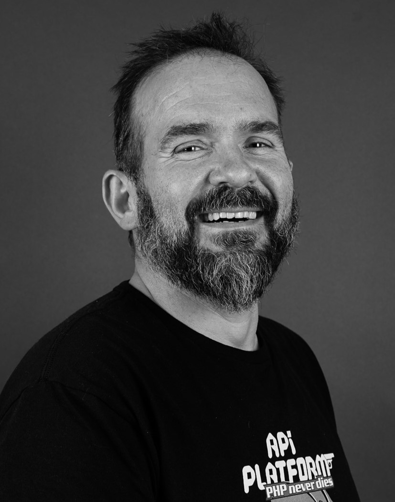

[.columns]
== Qui suis-je ?

[.column]
--

--

[.column.has-text-left]
--
**Nicolas Guérinet**

Lead Dev Backend PHP, Symfony / Drupal

TechLead, Architecte
--

[.column]
--

onepoint BDX
--

[NOTE.speaker]
====

Je suis lead développeur backend, spécialisé en PHP avec Symfony et Drupal.

Selon les besoins des projets, j’alterne entre un rôle d’architecte technique et un rôle de lead dev, au plus près de l’équipe, pour cadrer les choix d’implémentation, garantir la qualité du code et assurer la livraison des fonctionnalités en production.

onepoint, c’est un cabinet de conseil et de tech qui accompagne les organisations de la stratégie jusqu’au code en prod.

On travaille avec les équipes de dev sur l’architecture (cloud, data, API), le delivery agile, la CI/CD et les pratiques DevOps, en co‑construisant les solutions et en restant très proches du terrain et du code.

====