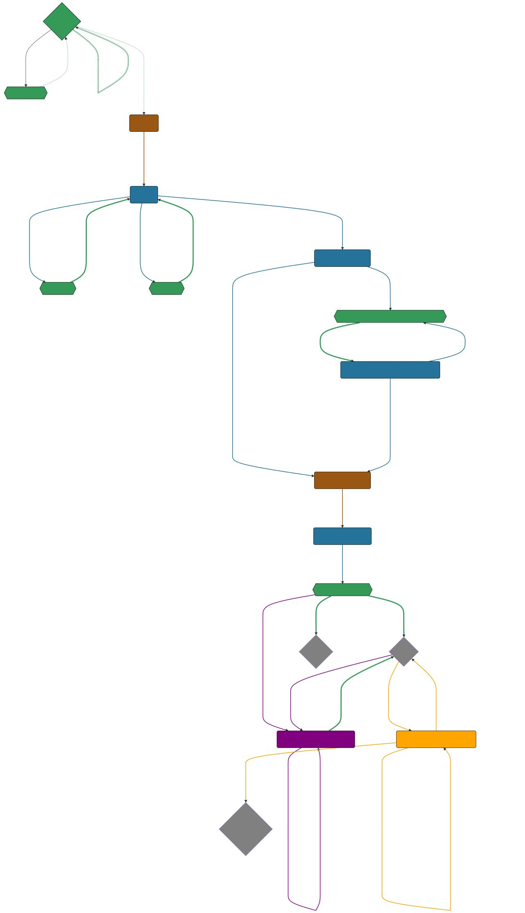

[.columns]
== La stack technique

[.column]
--
[step=1]
image::images/projet/symfony.svg[symfony,150px]
--

[.column]
--
[step=2]
image::images/projet/keycloak.svg[keycloak,150px]
--

[.column]
--
[step=3]
image::images/projet/postgres.png[postgres,150px]
--

[.column]
--
[step=4]

--

[NOTE.speaker]
====

* Backend Symfony
* Gestion : Identité Keycloak
* Stockage : Postgres
* Front : Angular

====

[.columns]
=== Gestion d'agrément

[.column]
--
image::images/projet/depot.svg[depot,350px]

[.credit]
_Illustration : https://storyset.com[Storyset]_
--

[.column]
--

--

[NOTE.speaker]
====
Plateforme de dépot de demande d'agrément.
Un agrément, c’est une **autorisation officielle délivrée par une autorité compétente** qui atteste qu’une organisation, une activité ou un dispositif respecte un ensemble de critères et de règles précis, et l’autorise à exercer dans un cadre donné.

* Constitution de dossier => beaucoup d'info à saisir
* Périmètre géographique
* Pièces jointes

Instruction de demande

* Analyse des dossiers
* Décision sur les dossiers
* recours ...
====

=== Cycle de vie d'un agrément

image::images/projet/instrution2.png[instruction,40%]

[NOTE.speaker]
====

* Analyse des demandes
* Suivi des agréments
* Gestion de la fraude

*Pour l'exemple, on ne va parler que des demandes*

====

[%notitle]
=== Contexte

[NOTE.speaker]
====
Ne cherchez pas à lire, il n'y a rien de marqué.

* Demande => cycle de vie complexe => symfo workflow
* Besoin de jeux de données pour chaque état / opérations.
* Historique / Audit / Traçabilité

*Pour générer tous ces outils, on me parle de fixtures ok c'est quoi*

====