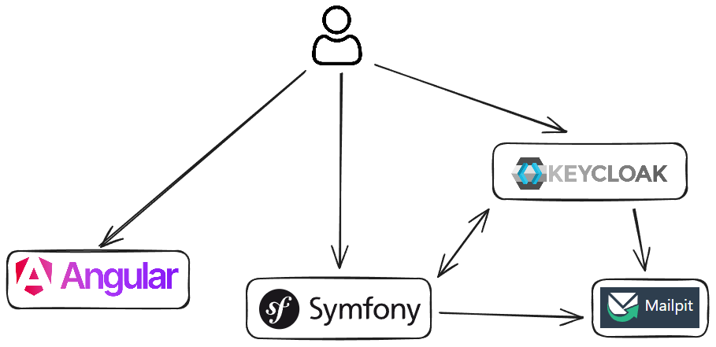

== La stack technique

[NOTE.speaker]
====

REX === contexte

Le projet sur lequel nous travaillons est une application web composée de 3 briques.

Backend / Frontend / Authentification

Mailpit

====

[%notitle]
=== Contexte

image::images/workflow_mar_complet.png[workflow,30%]

[NOTE.speaker]
====
Ne cherchez pas à lire, il n'y a rien de marqué.

Demande => cycle de vie complexe => symfo workflow

Besoin de jeux de données pour chaque état.

====

=== Demandes

[NOTE.speaker]
====
* Constitution de dossier => beaucoup d'info à saisir
* Périmètre géographique
* Pièces jointes
====

=== l'instruction

[NOTE.speaker]
====

Une fois un dossier constitué un demandeur va déposer son dossier.

Ces demandes sont instruites par des instructeurs et des superviseurs.

Historique / Audit / Traçabilité

J'ai donc besoin de créer des données pour chacune de ces opérations.

Pour générer tous ces outils, on me parle de fixtures ok c'est quoi
====