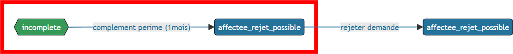

[%notitle]
== Il est temps de voyager

Et s'il était possible de manipuler le temps avec Symfony ?

[NOTE.speaker]
====

 Ca existe de forcer une date dans Symfony ?
====

=== SymfonyClock

[source, php,%numlines,highlight='1..2|4..5|7..9']
----
use function Symfony\Component\Clock\now;
$now = now();              /* ==> Maintenant */

Clock::set(new NativeClock());
$now = now();              /* ==> Maintenant */

Clock::set(new MockClock("2024-01-01"));
$now = now();              /* ==> 2024-01-01 00:00:00 */
$now = now('+10h');        /* ==> 2024-01-01 10:00:00 */

----

[NOTE.speaker]
====
SymfonyClock est une librairie qui permet de gérer le temps dans nos tests.
On peut donc fixer le temps à une date précise. (MockClock) ou utiliser le temps réel (NativeClock).

Avec MockClock, on a tout ce qu'il nous faut pour rendre notre cas de test réaliste.
====

=== SymfonyClock

[.r-stack]
--

[.fade-out, step=1]
[source, php,%numlines]
----
    $demande->dateDepot = new DateTime();

    public function onPreUpdate(): void
    {
        $this->dateModification = new DateTime();
    }

    public function __construct()
    {
        $this->dateCreation = new DateTime();
        ...
    }
----
[step=1]
[source, php,%numlines]
----
    $demande->dateDepot = now();

    public function onPreUpdate(): void
    {
        $this->dateModification = now();
    }

    public function __construct()
    {
        $this->dateCreation = now();
        ...
    }
----
--

=== Figeons le temps
[.r-stack]
--

[.fade-out, step=1]
image::images/fixtures/workflow_start_depose.png[workflow,100%]

[step=1]
[source,php,%linenums,highlight="1..2|1,4,7,10,13|1..14"]
----
Clock::set(new MockClock("2024-06-01"));
$this->demandeService->affecterDemande(user: $superviseur, demande: $demande, instructeur: $instructeur);

Clock::set(new MockClock("2024-06-08"));
$this->demandeService->demanderComplement(user: $instructeur, demande: $demande, commentaire: 'Commentaire');

Clock::set(new MockClock("2024-06-16"));
$this->demandeService->addPjsBrouillon($demande, "complement1.pdf", "complement");

Clock::set(new MockClock("2024-07-01"));
$this->demandeService->addPjsBrouillon($demande, "complement2.pdf", "complement");

Clock::set(new MockClock("2024-07-22"));
$this->demandeService->donnerComplement(user: $demandeur, demande: $demande);
----
--

[NOTE.speaker]
====

* 1 juin = affectation
* 8 juin = demane de complément
* 16 juin = ajout de fichier
* 1er juillet = ajout de fichier
* 22 juillet = donner complément

On peut maintenant fixer le temps pour chaque action.
Réaliste

====

=== Et rejetons, c'est possible

[.r-stack]
--

[.fade-out, step=1]

[step=1]
[source,php,%linenums,highlight="1..5|7..8|10,11|1..11"]
----
Clock::set(new MockClock("2024-07-23"));
$this->demandeService->affecterDemande(user: $superviseur, demande: $demande, instructeur: $instructeur);

Clock::set(new MockClock("2024-07-31"));
$this->demandeService->demanderComplément(user: $instructeur, demande: $demande, commentaire: 'Commentaire');

Clock::set(new MockClock("2024-09-01"));
$this->checkDelaiCommand->execute($this->input, $this->output);

Clock::set(new MockClock("2024-09-02"));
$this->demandeService->refuserDemande(user: $instructeur, demande: $demande, commentaire: 'Hors délai');
----
--
[NOTE.speaker]
====

* 23 juillet = affectation
* 31 juillet = demande de complément
* 1er septembre = vérification délai
* 2 septembre = refus de la demande

====

[.columns.is-vcentered]
=== En résumé
[%step]
[.column]
--
Données géographiques

Intervenants
--

[%step]
[.column]
--
Demandeurs

Fichiers

Demandes
--

[%step]
[.column]
--
Le temps
--

[NOTE.speaker]
====
Nous avons pu alimenter les données de base (géographique notamment).
Créer nos intervenants (instructeur, superviseur et admin).

On a un cas de test réaliste avec des utilisateurs qui peuvent se connecter (Demandeur, instructeur, superviseur).
Nous avons des fichiers que les utilsateurs peuvent consulter et donc vérifier leur présence.
On a pu créer nos données de manière cohérente.
Créer nos demandes

Gérer la temporalité des actions.

====
